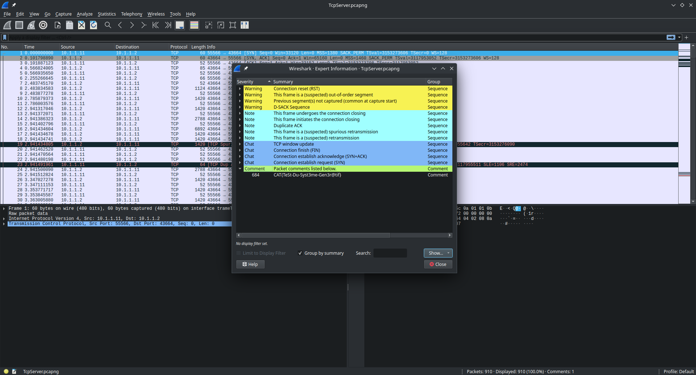
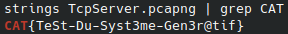

<!-- By mathys-lopinto -->
<h1 style="text-align: center;color: #ff0000;">A Network Trace - 2024</h1>

# FR

## Description

Alors que vous recherchez un moyen d apprendre plus d information sur les pirates de ce monde, vous tombez sur une étrange capture. Celle-ci est étrangement mise en avant, comme s ils veulent nous montrer quelque chose.

## Catégorie

Stéganographie

## Point et difficulté

8 points, facile

## Fichier fournis

[TcpServer.pcapng](https://github.com/mathys-lopinto/CatTheQuest2024_Write-Up/blob/main/A%20Network%20Trace/TcpServer.pcapng)

# Format du flag

``CAT{AhJe-Dd-Jhdg2jd-Goi1s#ldk}``

## Auteur

[mathys-lopinto](https://github.com/mathys-lopinto)

## Solution

Pour résoudre ce challenge, il suffit d'ouvrir le fichier pcapng avec Wireshark. Ensuite, il suffit de regarder les commentaires des packets pour trouver le flag.

## Solution alternative

Effectuer la commande ``strings TcpServer.pcapng | grep CAT`` et récupérer le flag.

# EN

## Description

As you search for a way to learn more about the pirates of this world, you come across a strange capture. It is oddly highlighted, as if they want to show us something.

## Category

Steganography

## Points and difficulty

8 points, easy

## Files provided

[TcpServer.pcapng](https://github.com/mathys-lopinto/CatTheQuest2024_Write-Up/blob/main/A%20Network%20Trace/TcpServer.pcapng)

# Flag format

``CAT{AhJe-Dd-Jhdg2jd-Goi1s#ldk}``

## Author

[mathys-lopinto](https://github.com/mathys-lopinto)

## Soluce

To solve this challenge, you just have to open the pcapng file with Wireshark. Then, you just have to look at the comments of the packets to find the flag.

## Alternative soluce

Run the command ``strings TcpServer.pcapng | grep CAT`` and get the flag.

# Flag

``CAT{TeSt-Du-Syst3me-Gen3r@tif}``

# Licence
 
This work is licensed under <a href="https://creativecommons.org/licenses/by-nc-sa/4.0/?ref=chooser-v1" target="_blank" rel="license noopener noreferrer" style="display:inline-block;">CC BY-NC-SA 4.0</a>
 