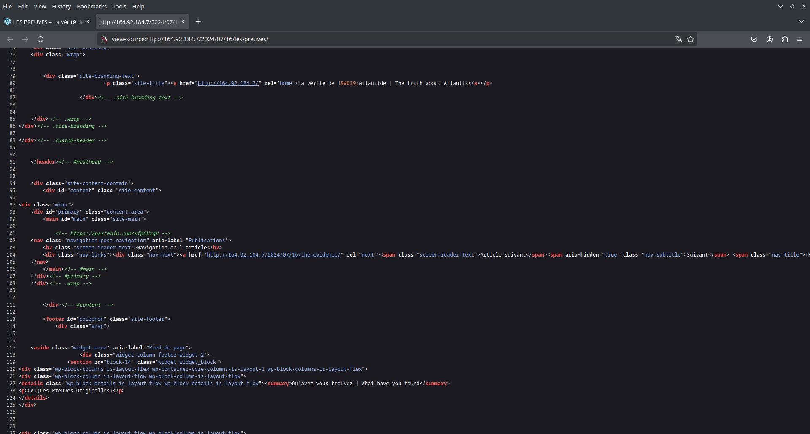
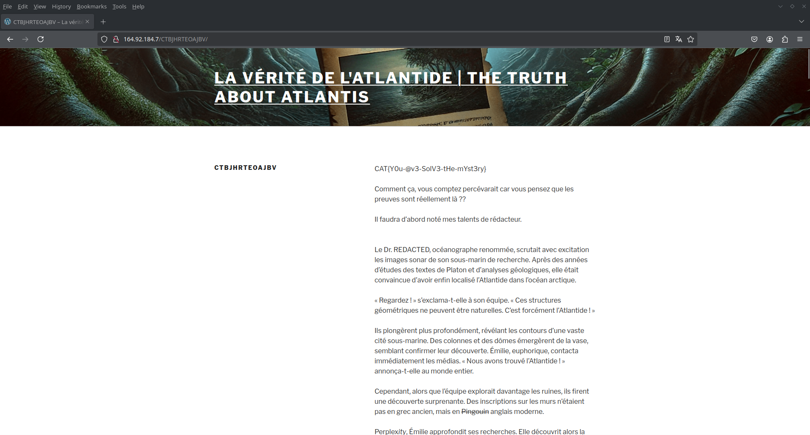
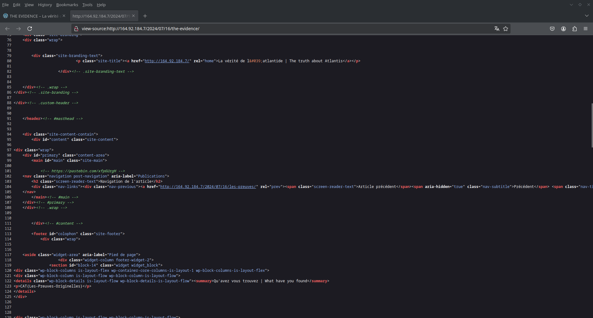
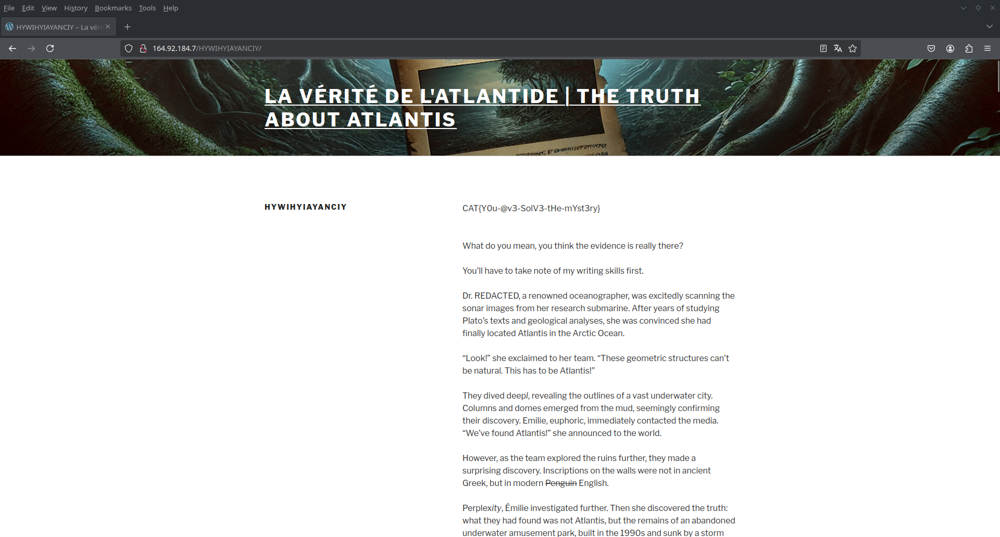

<!-- By mathys-lopinto -->
<h1 style="text-align: center;color: #ff0000;">Atlantide - A strange Website - 2024</h1>
<h2 style="text-align: center;color: #ff0000;">Part 3</h2>

# FR

## Description

Alors que vous vous trouvez devant ce site WordPress défaillant, une question persiste : comment un site aussi mal entretenu peut-il ne présenter aucune faille de sécurité ? Vous décidez donc d investiguer un peu plus profondément dessus.

## Catégorie

Web + Stéganographie

## Point et difficulté

16 points, moyen

## Format du flag

``CAT{Th3-H1st0rY-iS-n0w-3nd3d}``

## Auteur

[mathys-lopinto](https://github.com/mathys-lopinto)

## Solution

Nous devons donc repartir sur notre site WordPress que nous avons trouvée à l'étape précédente.

Donc de retour [dessus](http://164.92.184.7/) nous devions juste faire un truc bête et basique dans un challenge web: regarder le code source de la page. Nous ne trouvons rien sur les CGU mais nous trouvons un lien [pastebin](https://pastebin.com/xfp6UrgH) au niveau des posts.



Voici le contenu du pastebin:

```txt
french version:
/Comment ça! Tu es arrivée à trouvé cette page, Bravo.
Je pense que tu as dû comprendre, mais tout cela n'était qu'un escape game réalisé par les Hackers, que tu as brilamment Résolu. Tu as su décoder toutes les *majuscules* que j'ai semées au cours de mes nombreuses épreuves. Et Oui, l'Atlantide n'a Jamais été retrouvée. Bravo à toi pour être arrivée jusqu'ici et j'espère que tu je t'ai bien fait perdre ton temps. Vous ne nous retrouverez jamais.
 
english version:
/How! You managed to find this page, Well done.
I think you must have understood, but it was all just an escape game set up by the Hackers, which you solved brilliantly. You were able to decipher all the *upper case letter* that I hidden during my many trials. And Yes, Atlantis has Never been found. Congrats to you for getting this far and I hope you've wasted your time. You'll never find us again.
 
 
note:
each version can be made separately | chaques versions peuvet etre fait séparément
```

Les informations importantes sont les suivantes:

- Le ``/`` au début du pastebin signifiant un URL
- Le mot ``majuscules`` en italique dans le texte

Nous comprenons donc que nous devons trouver un lien caché dans le site WordPress. Pour cela, nous devons donc trouver les majuscules cachées dans ce Pastebin.

Nous trouvons donc les majuscules suivantes: ``CTBJHRTEOAJBV``, ce qui fournit le lien suivant: ``http://164.92.184.7/CTBJHRTEOAJBV/``

Lorsque nous allons sur [celui-ci](http://164.92.184.7/CTBJHRTEOAJBV/) nous obtenons le flag.



Ps: Si vous pensez qu'il reste quelque chose de cachée, voici le contenu de cette [page](https://github.com/mathys-lopinto/CatTheQuest2024_Write-Up/blob/main/Atlantide%20-%20A%20strange%20Website/CTBJHRTEOAJBV.pdf)

# EN

## Description

As you stand before this faulty WordPress site, a question persists: how can a site so poorly maintained present no security flaws? You decide to investigate a bit more deeply.

## Category

Web + Steganography

## Points and difficulty

16 points, medium

## Flag format

``CAT{Th3-H1st0rY-iS-n0w-3nd3d}``

## Author

[mathys-lopinto](https://github.com/mathys-lopinto)

## Solution

We must therefore return to our WordPress site that we found in the previous step.

So back [on it](http://164.92.184.7/) we just had to do something stupid and basic in a web challenge: look at the page's source code. We find nothing about the TOS but we find a [pastebin](https://pastebin.com/xfp6UrgH) link in the posts.



Here is the content of the pastebin:

```txt
french version:
/Comment ça! Tu es arrivée à trouvé cette page, Bravo.
Je pense que tu as dû comprendre, mais tout cela n'était qu'un escape game réalisé par les Hackers, que tu as brilamment Résolu. Tu as su décoder toutes les *majuscules* que j'ai semées au cours de mes nombreuses épreuves. Et Oui, l'Atlantide n'a Jamais été retrouvée. Bravo à toi pour être arrivée jusqu'ici et j'espère que tu je t'ai bien fait perdre ton temps. Vous ne nous retrouverez jamais.
 
english version:
/How! You managed to find this page, Well done.
I think you must have understood, but it was all just an escape game set up by the Hackers, which you solved brilliantly. You were able to decipher all the *upper case letter* that I hidden during my many trials. And Yes, Atlantis has Never been found. Congrats to you for getting this far and I hope you've wasted your time. You'll never find us again.
 
 
note:
each version can be made separately | chaques versions peuvet etre fait séparément
```

The important information is as follows:

- The ``/`` at the beginning of the pastebin meaning an URL
- The word ``upper case letter`` in italic in the text

We therefore understand that we must find a hidden link in the WordPress site. To do this, we must therefore find the hidden uppercase letters in this Pastebin.

We therefore find the following uppercase letters: ``HYWIHYIAYANCIY``, which provides the following link: ``http://164.92.184.7/HYWIHYIAYANCIY/``

When we go to [this one](http://164.92.184.7/HYWIHYIAYANCIY) we get the flag.



Ps: If you think there is something hidden, here is the content of this [page](https://github.com/mathys-lopinto/CatTheQuest2024_Write-Up/blob/main/Atlantide%20-%20A%20strange%20Website/HYWIHYIAYANCIY.pdf)

# Flag

``CAT{Y0u-@v3-SolV3-tHe-mYst3ry}``

# Licence
 <p xmlns:cc="http://creativecommons.org/ns#" >This work is licensed under <a href="https://creativecommons.org/licenses/by-nc-sa/4.0/?ref=chooser-v1" target="_blank" rel="license noopener noreferrer" style="display:inline-block;">CC BY-NC-SA 4.0</a></p> 