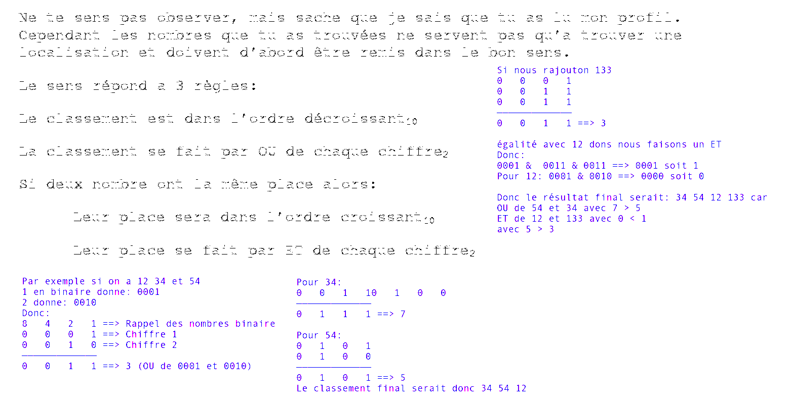
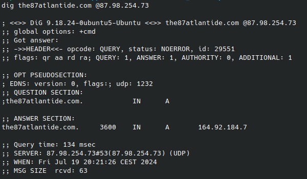
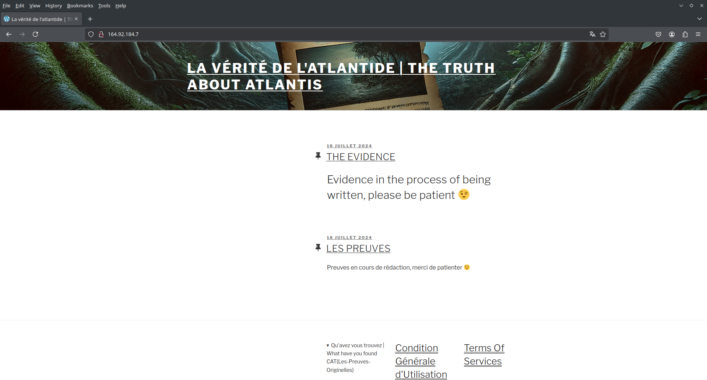
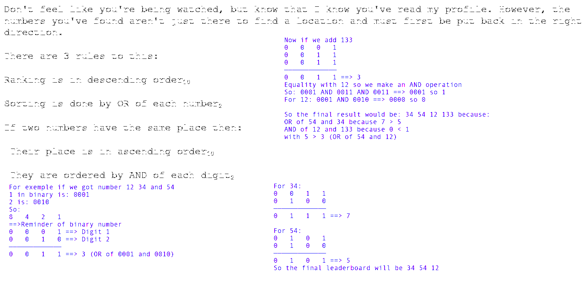

<!-- By mathys-lopinto -->
<h1 style="text-align: center;color: #ff0000;">Atlantide - A strange discovery - 2024</h1>
<h2 style="text-align: center;color: #ff0000;">Part 2</h2>

# FR

## Description

Alors que vous vous plongez dans cette énigme intrigante, une question persiste : Comment les scientifiques ont-ils pu passer à côté de cette découverte si longtemps ? Cependant, un détail troublant capte votre attention : comment le membre a-t-il pu faire valider son adresse e-mail si le domaine n a jamais été louée ? Pourriez-vous être sur la piste d un mystère bien plus vaste que ce que vous aviez imaginé ? Poussé par l adrénaline, vous décidez de poursuivre vos investigations, mais vous devez cependant avancée dans la foret. Après être entrée dans les ruines, vous êtes tombées sur un autre papier, avant d avancer je devrais commencer par comprendre celui ci.
Soudain, une pensée traverse votre esprit : peut-être que CERTains des éléments trouvés dAns l étape précédente, couplés au TXT, pourront me faire avancer. Je devrais peut être coNSulter les différents éléments que j ai à ma disposition.
Une lueur d espoir se dessine alors dans votre esprit, vous incitant à explorer plus en profondeur ces indices inattendus. Avec détermination et curiosité, vous vous lancez dans cette nouvelle phase de votre enquête, prêt à percer le mystère qui se dessine devant vous.
La question reste de savoir, qu avez vous découvert ?

## Catégorie

Stéganographie + Réseau

## Point et difficulté

12 points, Difficile

## Fichier fournis

[Message-Etrange-Trouve.png](https://github.com/mathys-lopinto/CatTheQuest2024_Write-Up/blob/main/Atlantide%20-%20A%20strange%20discovery/Message-Etrange-Trouve.png)

## Format du flag

``CAT{Une-Magnifique-Découverte}``

## Auteur

[mathys-lopinto](https://github.com/mathys-lopinto)

## Solution

Pour résoudre ce challenge, nous allons tout d'abord ouvrir l'image fournie. Nous remarquons que l'image contient du texte, écris en pseudo blanc (donc invisible mais présent). Pour révéler ce texte, nous pouvons utiliser un logiciel de retouche d'image pour changer le fond de l'image en noir, nous pouvons aussi passée l'image sur [StegOnline](https://www.georgeom.net/StegOnline) et utiliser l'option "LSB Half" pour révéler le texte ([Aperi'Solve](https://www.aperisolve.com/) fonctionne [aussi](https://www.aperisolve.com/413a7be4a50cd61c1ee75e53148b24e7)).
Nous obtenons donc l'image suivante:

Nous voyons que le texte nous donne des indications sur le classement de nombres.

Revenons maintenant sur la description du challenge, nous pouvons voir que certaines phrases sont utiles pour la résolution du challenge:

- "comment le membre a-t-il pu faire valider son adresse e-mail si le domaine n a jamais été louée ?"

> Le domaine n'a jamais été loué, cela signifie que le domaine n'existe pas, donc un serveur DNS custom a été mis en place pour valider l'adresse e-mail. Nous aurons donc à utilisée le domaine ``the87Atlantide.com``

- "peut-être que CERTains des éléments trouvés dAns l étape précédente, couplés au TXT, pourront me faire avancer. Je devrais peut être coNSulter les différents éléments que j ai à ma disposition."

> Les majuscules dans le texte sont des indices pour la résolution du challenge. Nous avons les lettres A, NS, CERT et TXT qui nous rappellent les enregistrements DNS.

- "Alors que vous vous plongez dans cette énigme intrigante"

> Nous comprenons donc ici que nous continuons l'histoire donc les résultats trouvée avant nous seront surement utile

Nous savons donc que nous allons avoir besoin de faire une requete vers un serveur DNS. Cependant il nous manque l'IP de celui ci, mais étant une histoire qui se suit, nous comprenons qu'il faut utiliser nos anciens nombre, d'autant plus que ceux-ci sont au nombre de 4 et tous inferieur à 255.

Rappel des nombres: 87 254 98 73

Commençont par l'étape 1: Le OU

1 0 0 0 ==> 8
0 1 1 1 ==> 7
\-\-\-\-\-\-\-\-\-
1 1 1 1 ==> 8 + 4 + 2 + 1 = 15

0 0 1 0 ==> 2
0 1 0 1 ==> 5
0 1 0 0 ==> 4
\-\-\-\-\-\-\-\-\-
0 1 1 1 ==> 4 + 2 + 1 = 7

1 0 0 1 ==> 9
1 0 0 0 ==> 8
\-\-\-\-\-\-\-\-\-
1 0 0 01 ==> 8 + 1 = 9

0 1 1 1 ==> 7
0 0 1 1 ==> 3
\-\-\-\-\-\-\-\-\-
0 1 1 1 ==> 7

Si nous suivons uniquement les 2 premières étapes, voici le classement:

1. 87 (15)
2. 98 (9)
3. 254/ 73 (7)
4. 254/ 73 (7)

Afin de résoudre l'égualité nous allons faire notre ET sur notre égalité

0 0 1 0 ==> 2
0 1 0 1 ==> 5
0 1 0 0 ==> 4
\-\-\-\-\-\-\-\-\-
0 0 0 0 ==> 0

0 1 1 1 ==> 7
0 0 1 1 ==> 3
\-\-\-\-\-\-\-\-\-
0 0 1 1 ==> 2 + 1 = 3

Notre classement final est donc:

1. 87 (15)
2. 98 (9)
3. 254 (7 et 0 < 3)
4. 73 (7 et 3 > 0)

Nous obtenons donc l'ip ``87.98.254.73``

Nous savons qu'il faut faire:

- Une requete DNS
- En utilsant le nom de domaine the87Atlantide.com
- Sur l'ip 87.98.254.73

Nous effectuons donc notre requete en utilisant l'outil [dig](https://man.archlinux.org/man/dig) ([nslookup](https://man.archlinux.org/man/nslookup) fonctionne aussi):
``dig the87atlantide.com @87.98.254.73``

Nous obtenons donc l'adresse IP ``164.92.184.7`` qui devrait héberger le domaine.

Lorsque nous nous rendons sur la page du [site](http://164.92.184.7), nous trouvons en dessous de la categorie "Qu'avez vous trouvez | What have you found" le flag

# EN

# Description

As you delve into this intriguing enigma, one question lingers: How could scientists have missed this discovery for so long? However, a disturbing detail catches your attention: how could the member have his e-mail address validated if the domain was never rented? Could you be on the trail of a much bigger mystery than you had imagined? Driven by adrenalin, you decide to continue your investigations, but you must nevertheless advance into the forest. After entering the ruins, you come across another piece of paper, and before moving on, I should start by understanding this one.
Suddenly, a thought crosses your mind: maybe some of the elements found in the previous step, coupled with the TXT, can help me move forward. Maybe I should coNSult the different elements I have at my disposal.
A ray of hope then appears in your mind, prompting you to explore these unexpected clues in greater depth. With determination and curiosity, you embark on this new phase of your investigation, ready to unravel the mystery unfolding before you.
The question remains, what have you discovered?

# Category

Steganography + Network

# Points and difficulty

12 points, Hard

# Files provided

[Strange_message_found.png](https://github.com/mathys-lopinto/CatTheQuest2024_Write-Up/blob/main/Atlantide%20-%20A%20strange%20discovery/Strange_message_found.png)

# Flag format

``CAT{A-Magnificent-Discovery}``

# Author

[mathys-lopinto](https://github.com/mathys-lopinto)

# Solution

To solve this challenge, we will first open the provided image. We notice that the image contains text, written in pseudo white (so invisible but present). To reveal this text, we can use an image editing software to change the background of the image to black, we can also pass the image on [StegOnline](https://www.georgeom.net/StegOnline) and use the "LSB Half" option to reveal the text ([Aperi'Solve](https://www.aperisolve.com/) also [works](https://www.aperisolve.com/5fc115d57075941101ff09d488453ef8)).

We see that the text gives us indications on the ranking of numbers.

Let's go back to the challenge description, we can see that some sentences are useful for solving the challenge:

- "how could the member have his e-mail address validated if the domain was never rented?"

> The domain was never rented, this means that the domain does not exist, so a custom DNS server was set up to validate the e-mail address. We will therefore have to use the domain ``the87Atlantide.com``

- "maybe some of the elements found in the previous step, coupled with the TXT, can help me move forward. Maybe I should coNSult the different elements I have at my disposal."

> The capital letters in the text are clues for solving the challenge. We have the letters A, NS, CERT and TXT which remind us of DNS records.

- "As you delve into this intriguing enigma"

> We understand here that we are continuing the story so the results found before us will surely be useful

We know that we will need to make a request to a DNS server. However, we are missing the IP of this server, but being a story that follows, we understand that we must use our old numbers, especially since there are 4 of them and all are less than 255.

Reminder of the numbers: 87 254 98 73

Let's start with step 1: The OR

1 0 0 0 ==> 8
0 1 1 1 ==> 7
\-\-\-\-\-\-\-\-\-
1 1 1 1 ==> 8 + 4 + 2 + 1 = 15

0 0 1 0 ==> 2
0 1 0 1 ==> 5
0 1 0 0 ==> 4
\-\-\-\-\-\-\-\-\-
0 1 1 1 ==> 4 + 2 + 1 = 7

1 0 0 1 ==> 9
1 0 0 0 ==> 8
\-\-\-\-\-\-\-\-\-
1 0 0 01 ==> 8 + 1 = 9

0 1 1 1 ==> 7
0 0 1 1 ==> 3
\-\-\-\-\-\-\-\-\-
0 1 1 1 ==> 7

If we only follow the first 2 steps, here is the ranking: 

1. 87 (15)
2. 98 (9)
3. 254/ 73 (7)
4. 254/ 73 (7)

In order to solve the equality we will do our AND on our equality

0 0 1 0 ==> 2
0 1 0 1 ==> 5
0 1 0 0 ==> 4
\-\-\-\-\-\-\-\-\-
0 0 0 0 ==> 0

0 1 1 1 ==> 7
0 0 1 1 ==> 3
\-\-\-\-\-\-\-\-\-
0 0 1 1 ==> 2 + 1 = 3

Our final ranking is therefore:

1. 87 (15)
2. 98 (9)
3. 254 (7 et 0 < 3)
4. 73 (7 et 3 > 0)

We get the ip ``164.92.184.7``

We know that we have to make:

- A DNS request
- Using the domain name the87Atlantide.com
- On the ip

We therefore perform our query using the [dig](https://man.archlinux.org/man/dig) tool ([nslookup](https://man.archlinux.org/man/nslookup) also works):
``dig the87atlantide.com @87.98.254.73``

We get the IP address ``164.92.184.7``

When we go to the [site] page (http://164.92.184.7), we find under the category “Qu'avez vous trouvé | What have you found” the flag.

# Flag

``CAT{Les-Preuves-Originelles}``

# Licence
 
This work is licensed under <a href="https://creativecommons.org/licenses/by-nc-sa/4.0/?ref=chooser-v1" target="_blank" rel="license noopener noreferrer" style="display:inline-block;">CC BY-NC-SA 4.0</a>
 